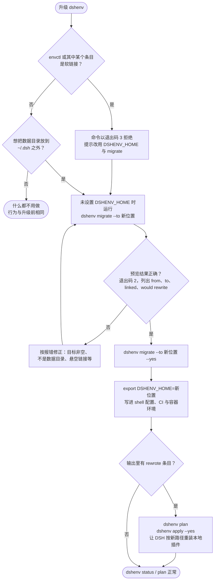
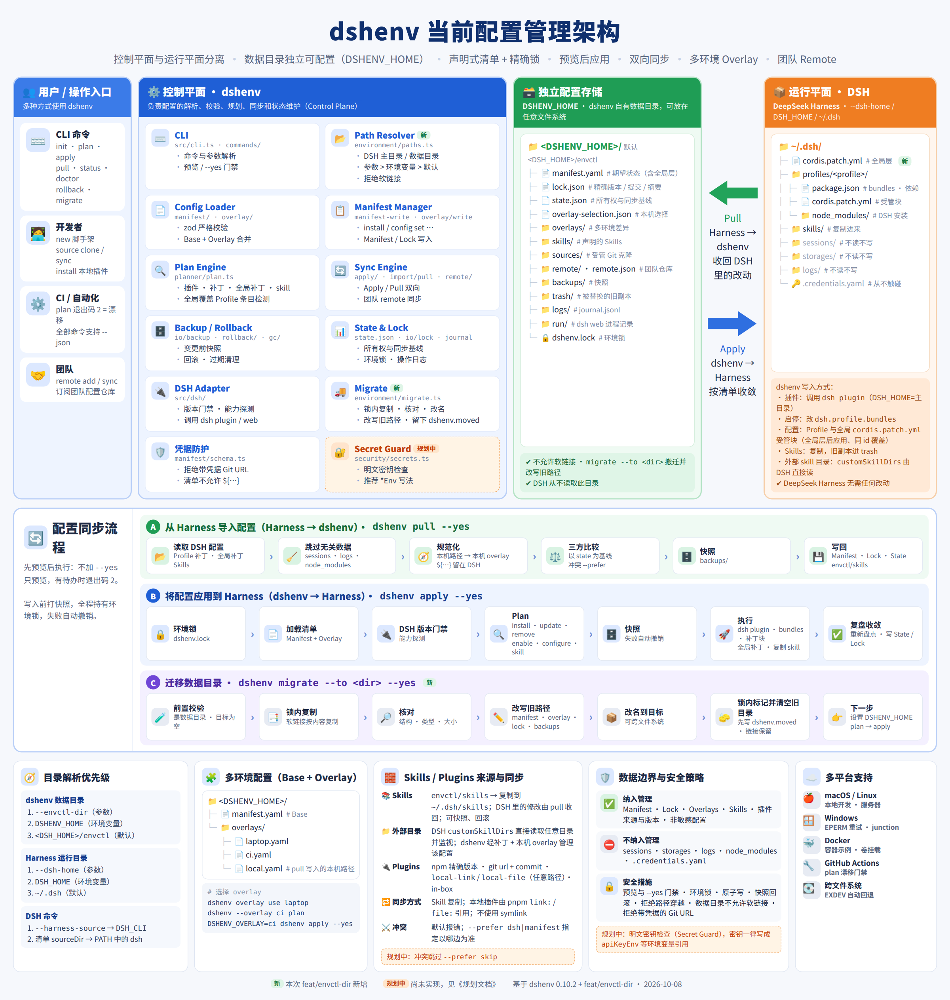
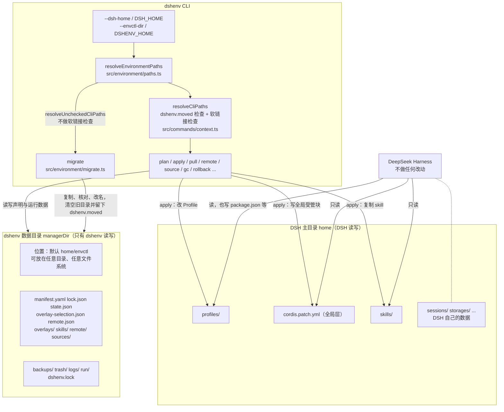
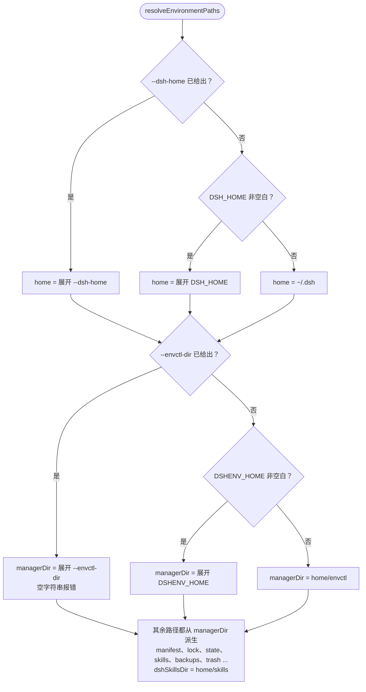
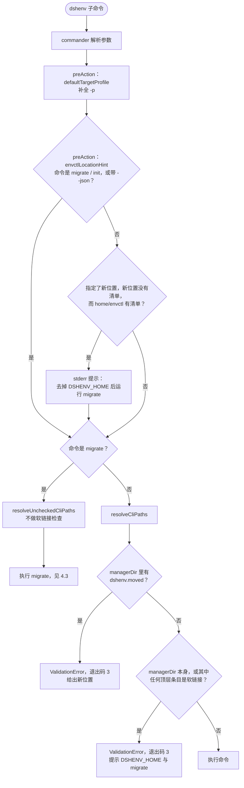
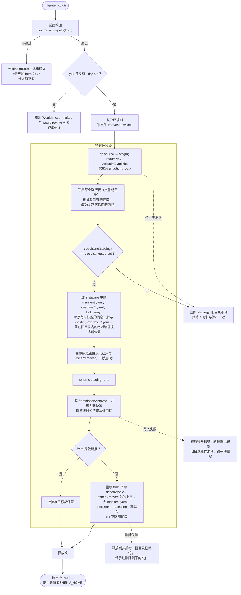
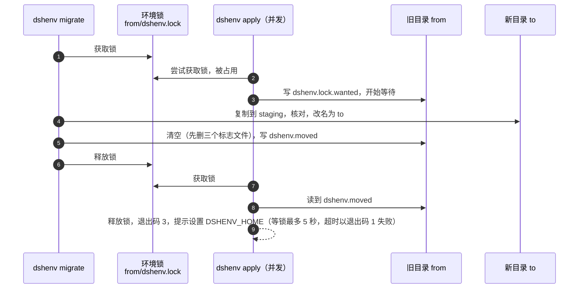
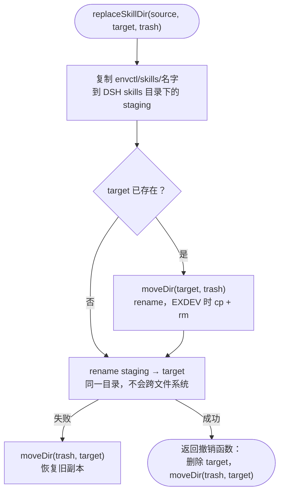

# dshenv 设计文档：数据目录外置与 DSH 配置对齐

- 日期：2026-10-08
- 分支：`feat/envctl-dir`，已经 PR #149 合并到 `master`
- 依据：DSH 源码 `deepseek-harness` 提交 `5badb15009`（0.2.1-alpha.1）；本机 `~/.dsh`。dshenv 当前放行 DSH `0.1.7`、`0.2.0`、`0.2.1`
- DSH 配置参考：[2026-10-08-DSH配置参考.md](2026-10-08-DSH配置参考.md)
- 架构图：[images/dshenv-architecture.png](images/dshenv-architecture.png)（源文件 [architecture/dshenv-architecture.html](architecture/dshenv-architecture.html)）

本文覆盖 `feat/envctl-dir` 分支的三项工作：数据目录外置（`--envctl-dir` / `DSHENV_HOME` / `migrate`）、全局补丁层（`$DSH_HOME/cordis.patch.yml`）、DSH 0.2.0 版本门禁与 `insert` 相对路径；以及随后按第 9 节规划实现的里程碑 3–7（Secret Guard、放宽 `${...}`、`apply` 前的补丁 id 校验、被跳过的 bundle、`pull --prefer skip` 等，见附录 A.4）。阅读顺序：想知道做了什么、要不要操作，看第 1、2 节；想了解实现，看第 3–6 节；评审风险与后续工作，看第 7–9 节；任务、测试与改动文件在附录。DSH 配置本身的事实见 DSH 配置参考。

术语：

- **数据目录**：dshenv 自己的目录，代码里叫 `managerDir`，默认 `$DSH_HOME/envctl`，可用 `--envctl-dir` / `DSHENV_HOME` 外置。下文的 `envctl` 都指它。
- **DSH 主目录**：`$DSH_HOME`，默认 `~/.dsh`。
- **全局层**：文件 `$DSH_HOME/cordis.patch.yml`；补丁目标名 `@home`，操作类型 `home-patch`，输出前缀 `[global]`。
- **墓碑文件**：`migrate` 在旧数据目录里留下的 `dshenv.moved`，内容是新位置。

## 1. 概述

### 1.1 现状一览

| 方向 | 内容 | 状态 |
|---|---|---|
| 数据目录外置 | `--envctl-dir` / `DSHENV_HOME`、拒绝软链接、`migrate`（路径改写、墓碑文件）| 已合并（PR #149） |
| DSH 配置对齐 | 全局补丁 `$DSH_HOME/cordis.patch.yml` | 已合并（PR #149） |
| DSH 配置对齐 | 适配 DSH 0.2（门禁放行 0.2.0）、相对路径进本机 overlay | 已合并（PR #149；附录 A.3） |
| DSH 配置对齐 | `apply` 前的补丁 id 校验、被跳过的 bundle、全局层重启提示、放宽 `${...}`、`compatibility.json` 展示、退役 bundle 警告 | 已合并（PR #149；附录 A.4） |
| DSH 配置对齐 | 放行 DSH 0.2.1；DSH 官方 bundle（`plugins official`、模板 Profile 自动创建） | 已实现，待合并（9.6 节） |
| 架构缺口 | 明文密钥检查（Secret Guard）、`pull --prefer skip` | 已合并（PR #149；9.2、9.3 节，附录 A.4） |
| 架构缺口 | Secret Guard 用 DSH schema 的 `credential-ref` 豁免 | 不做：DSH 里标 `credential-ref` 的字段都以 `Env` 结尾，已按键名豁免（9.1 节） |
| DSH 配置对齐 | 全局层覆盖警告按字段比较、`-p` 下也提示、单独点出 `disabled` | 已合并（PR #149；9.1 节） |
| 指定位置的 Skill / Plugin | DSH `customSkillDirs` + `local-link` | 无需开发，现有能力已覆盖（[DSH 配置参考](2026-10-08-DSH配置参考.md)第 4 节） |

### 1.2 背景

**数据目录**：dshenv 的数据目录 `envctl`（清单、lock、state、overlay、声明的 skill、快照、trash、日志）固定在 `<DSH 主目录>/envctl`。想放到别处只能做软链接，带来两个问题：

1. 同一份内容出现在两个位置，快照、trash、回滚、复制 skill 时处处要特判按链接还是按内容复制（PR #148 修的就是这类问题）。
2. 用户希望 `~/.dsh` 只保留 DSH 自己的数据，dshenv 的数据放到指定位置，并且不改 deepseek-harness。

DSH 读写 `profiles/`，读 `skills/` 与全局 `cordis.patch.yml`，从不读写 `envctl`，所以数据目录放在哪里与 DSH 无关。

**全局补丁层**：全局 `$DSH_HOME/cordis.patch.yml` 原先不受 dshenv 管理：本机有 4 组条目 `plan` 看不见、`pull` 收不回，同 id 时还会让 dshenv 写进 Profile 的配置不生效，`plan` 却显示已同步。设计见第 5 节。

### 1.3 目标与不做的事

目标：

- 用 `--envctl-dir <path>` 或 `DSHENV_HOME` 指定数据目录，参数优先；都不设置时仍是 `<DSH 主目录>/envctl`。
- 数据目录本身及其顶层条目不允许是软链接，遇到时拒绝并说明怎么改。
- 提供 `dshenv migrate --to <dir>`，把现有数据目录（包括软链接方式放在别处的）搬到新位置。
- 不改 deepseek-harness。

不做：

- 不搬 DSH 自己的数据。本机 `~/.dsh` 共 48M，其中 `sessions/` 39M、`storages/` 6.7M，`envctl` 约 220K。本功能解决的是“两类数据分开放”，不会明显缩小 `~/.dsh`。
- 不禁止 `envctl/skills/<名字>` 单个 skill 目录用软链接，按内容快照它由 PR #148 实现（已合并）。
- 不在首次使用时自动搬迁，只能显式执行。
- 不做配置文件（如 `~/.config/dshenv/config.yaml`）。

## 2. 上线与兼容性

### 2.1 数据目录外置



1. 评审并合并 `feat/envctl-dir`。
2. 发布说明提醒用软链接放置 `envctl` 的用户，升级后先执行：
   ```bash
   dshenv migrate --to <新位置> --yes
   export DSHENV_HOME=<新位置>
   ```
3. 把 `DSHENV_HOME` 写进 shell 配置文件，或运行 dshenv 的 CI / 容器环境。

### 2.2 全局补丁层

- 现有用户无需操作：清单没有顶层 `patches` 时，`plan` 只把全局文件里的手写条目列为 `? [global] …`，不改文件。
- 想接管时运行 `dshenv pull --yes`。全局文件会被整理成受管块，效果不变，格式会重写。
- `plan --json` 新增三个字段，是向后兼容的扩展。

### 2.3 兼容性

| 场景 | 行为 |
|---|---|
| 未设置新参数与环境变量 | 与之前完全相同 |
| `DSHENV_HOME` 指向空目录、默认位置有清单 | 命令照常执行，stderr 提示迁移 |
| `envctl` 本身或任何顶层条目是软链接 | 退出码 3，提示 `migrate`（**破坏性变更**） |
| 数据目录与 DSH 主目录跨文件系统 | skill 移入 trash 与撤销改为复制后删除 |
| 单个 skill 目录是软链接 | 不受影响 |
| JSON 输出 | 现有结构不变；`migrate --json` 输出 `MigrateResult` |
| 迁移之后在旧位置运行命令 | 旧位置只剩 `dshenv.moved`（从软链接搬迁时是链接目标里多了它），命令以退出码 3 拒绝并给出新位置 |

## 3. 架构

### 3.1 总体架构



dshenv 分三层：

- **控制平面**：dshenv CLI。模块有路径解析 `environment/paths.ts`、清单 `manifest/`、overlay `overlay/`、Plan `planner/`、执行 `apply/`、收回 `import/pull.ts`、团队 remote `remote/`、快照 `io/backup.ts`、回滚 `rollback/`、状态 `state.json` 与 `io/journal.ts`，以及 DSH 适配层 `dsh/`（版本门禁、能力探测、调用 DSH CLI）。
- **配置存储**：dshenv 数据目录 `envctl`，只有 dshenv 读写。
- **运行平面**：DSH 主目录 `~/.dsh`。dshenv 只写三处：Profile 的 `package.json`（插件经 DSH CLI 安装；`dsh.profile.bundles` 由 dshenv 持锁直接改写，`src/apply/bundles.ts`）、`cordis.patch.yml` 的受管块（Profile 层与全局层；`pull` 会把受管块外的手写条目收进受管块）、`skills/`。



DSH 从不读 dshenv 数据目录，所以数据目录放在哪里与 DSH 无关，这是数据目录外置不需要改 DSH 的原因。

### 3.2 dshenv 依赖的补丁语义

细节见 DSH 配置参考第 3 节。

```
bundle 补丁（按 dsh.profile.bundles 顺序）
  → profiles/<p>/cordis.patch.yml
  → $DSH_HOME/cordis.patch.yml
  → 每个 --patch（按参数顺序）
```

- **同 id 整体替换**：后面的层按 id 匹配，`target[key] = value` 整字段替换，`config` 不深合并。所以全局层的同 id 条目会让 Profile 层的同名字段失效（第 5 节）。
- **没有删除**：关掉一行只能写 `disabled: true`；匹配不到的 id 只警告。
- **空文件让启动失败**：补丁文件为空或只有注释时 DSH 启动失败，所以 dshenv 清空时写 `[]`。
- **热重载**：只有启用了 `hmr` 行的 Profile（出厂模板中只有 `web`）会自动重载补丁文件，其他 Profile 要重启。
- **`--dump-config`**：只做 YAML 组合，不加载插件、不求值 `!!js`。dshenv 用 stdout 探测 `hmr` 行（`src/dsh/hmr.ts`），用 stderr 找匹配不到的补丁条目和被跳过的 bundle（`src/dsh/dump-check.ts`）。

### 3.3 DSH 行为对 dshenv 的影响

| DSH 行为 | 影响 | 当前处理 |
|---|---|---|
| 插件页启停插件时，改写 Profile 补丁里最后一条同 id 覆盖项的 `disabled` | 这条覆盖项可能就在 dshenv 受管块内，受管块因此变成手改 | 三方比较视为 DSH 侧改动：`plan` 列出，`pull` 收回 |
| config-editor 拒绝保存被全局补丁覆盖的字段 | 用户在 UI 里改不动 dshenv 写进全局层的配置 | `plan` 的 `shadowedPatches` 警告列出这些 id，并提示改清单的顶层 `patches`、不要在 UI 里改；README 有同样的说明 |
| 全局补丁里写了某个 id 的 `disabled`，插件页只改 Profile 层 | 用户在插件页启停这个插件不生效，界面上也没有提示 | 全局条目写了 `disabled` 的 id 无论 Profile 条目写什么都会列出，并单独注明插件页启停不了它（`--json` 的 `disabled`） |
| `insert` 行的相对 `name` 按补丁文件所在目录解析 | 同一条目放在 Profile 层（`profiles/<p>/`）和全局层（`$DSH_HOME`）时指向不同位置 | `containsLocalPath` 把 `insert` 行及其 group 子行中以 `./`、`../` 开头的 `name` 视为本机路径，`pull` 时收进本机 overlay |
| bundle 加载失败只跳过，不报错 | `plan` 显示已同步，但 bundle 实际没有生效 | `status` / `doctor` 运行 `--dump-config`，解析 `skipping profile bundle` 行并报告，`status` 记为 `degraded` |
| `--dump-config` 会写 Profile 目录，缺失的出厂模板 Profile 会被创建 | 只读命令可能产生副作用 | 已规避创建：调用前先确认 Profile 存在（`src/commands/tools.ts`、`src/commands/plugins.ts`、`src/apply/apply.ts`、`src/apply/patch-targets.ts`、`src/commands/inspect.ts`）。`status` / `doctor` 的 dump 仍会重写真实 Profile 的 `cordis.yml`（见 7.1 节） |
| `--dump-config` 每次重写 Profile 的 `cordis.yml`，0.2.1 加载时还会改写 `package.json`（删除退役 bundle） | 在临时 DSH 主目录副本里校验时，经软链接写到真实文件 | 副本里主目录下的目录用软链接、其余文件不放入；Profile 目录里的目录用软链接、文件复制，`cordis.yml` 不放入；悬空的链接跳过（`src/dsh/dump-check.ts`） |
| 匹配不到 id 的补丁条目只在 stderr 报 `dsh: [<层>] patch: entry "<id>" not found` 并跳过 | 写错 id 的条目静默不生效 | `apply` 前校验，新增的匹配不到时中止（9.1 节原 P1 项，附录 A.4） |

## 4. 设计：数据目录外置

### 4.1 路径解析

文件：`src/environment/paths.ts`。`ResolvePathsInput` 新增 `cliEnvctlDir`（`--envctl-dir`）与 `envEnvctlDir`（`DSHENV_HOME`）。



- “展开”指 `resolveHomePath`（这次导出）：开头的 `~`、`~/`、`~\` 换成用户主目录，相对路径按当前工作目录转为绝对路径；一律用 `path.resolve`，结尾的分隔符被去掉（否则 `lstat` 对 `link/` 会跟随软链接，绕过软链接检查）。空白的 `DSHENV_HOME` 视为未设置，与 `DSH_HOME` 一致。
- `resolveEnvironmentPaths` 仍是纯函数，不读文件系统。
- 唯一在两个目录之间 `rename` 的操作是 skill 移入 trash，跨文件系统的处理见 4.5 节（复制 skill、写快照只做复制，不受影响）。

### 4.2 CLI 入口与软链接检查

文件：`src/cli.ts`、`src/commands/context.ts`

- 全局参数 `--envctl-dir <path>`；帮助的环境变量列表加 `DSHENV_HOME`；常量 `ENVCTL_ENV = 'DSHENV_HOME'`。
- `resolveCliPaths(opts)`：解析后先调用 `assertEnvctlNotMoved`（墓碑文件，4.4 节），再调用 `assertEnvctlNotLinked`，所有现有命令自动获得这两项检查。
- `resolveUncheckedCliPaths(opts)`：只解析不检查，只给 `migrate` 用，因为它要处理软链接形式的旧目录。

软链接检查：

- 对象是 `managerDir` 本身及其每个顶层条目，文件和目录都算。不维护固定子目录清单，以后新增的条目自动在范围内。
- 用 `lstat` / `Dirent` 判断，不跟随链接；目录不存在时跳过。
- 发现软链接抛 `ValidationError`（退出码 3），信息里给出 `DSHENV_HOME` / `--envctl-dir` 与 `dshenv migrate --to <dir> --yes`。
- 不检查 `managerDir` 的祖先目录，也不检查 `skills/<名字>` 这一层（单个 skill 链接按内容快照由 PR #148 实现，已合并）。
- 选择拒绝而不是兼容：否则快照、trash、回滚、`migrate` 都要区分“复制链接”还是“复制内容”。

迁移提示 `envctlLocationHint` 注册为 `preAction` 钩子。同时满足以下条件时向 stderr 写一行提示（不改变命令行为）：

- 命令不是 `migrate` 或 `init`，也没有 `--json`（`init` 表示有意在新位置建新环境）；
- `managerDir` 不等于 `<home>/envctl`；
- 新位置没有 `manifest.yaml`，而 `<home>/envctl/manifest.yaml` 存在。



### 4.3 `migrate` 命令

文件：`src/commands/migrate.ts`（CLI 外壳）、`src/environment/migrate.ts`（逻辑）、`src/environment/moved.ts`（墓碑文件）

```
dshenv migrate --to <dir> [--dry-run] [-y, --yes] [--json]
```

- 不加 `--yes` 或加了 `--dry-run` 时只预览，退出码 2，由 `reportPreview` 统一处理（与 `gc`、`purge` 一致）。
- 源目录是当前解析出的 `managerDir`，所以要在设置 `DSHENV_HOME` 之前运行。帮助分组在 `Maintenance:`。

输出：

```ts
interface MigrateResult {
  dryRun: boolean;
  from: string;        // 原 managerDir（链接本身的路径）
  to: string;          // 目标绝对路径
  linked: string[];    // 原目录本身或其顶层条目中是软链接的那些
  rewritten: string[]; // "文件: 旧路径 -> 新路径"
  skipped: string[];   // 读不了、因此没有改写的快照文件
}
```

文本输出为 `Would move` 或 `Moved envctl from A to B`，逐条列出 `linked`（按内容复制、目标保留）、`would rewrite` / `rewrote` 与读不了的快照文件；完成后提示设置 `DSHENV_HOME=<to>`，有改写时再提示 `plan` 与 `apply --yes`。

前置校验（预览时也执行）：

| 条件 | 结果 |
|---|---|
| `from`（`resolveHomePath` 已去掉结尾分隔符）里有 `dshenv.moved` | `ValidationError`：给出它已被移到的位置 |
| `from` 不存在，或解析后不是目录 | `ValidationError`；例外：`from` 本身是悬空软链接时 `realpath` 抛 ENOENT，退出码 1 |
| `from` 里没有 `manifest.yaml`、`lock.json`、`state.json` 中任何一个 | `ValidationError`：不是 dshenv 数据目录。防止 `DSHENV_HOME` 设错时删掉无关目录 |
| `from` 的顶层条目中有悬空软链接 | `ValidationError`：请先删除或修正。更深层的悬空链接按原样复制 |
| 源（链接路径或真实路径）与目标互相包含 | `ValidationError` |
| 目标存在且不是空目录 | `ValidationError` |
| 目标是空目录，或只有 `dshenv.moved`（把数据目录移回原处） | 允许，改名前先删除 |
| `manifest.yaml`、`lock.json` 或 overlay 读不了 | `ValidationError`，报错带文件名，什么都不改 |

执行流程：



`staging` 为 `<to>.dshenv-migrate-<pid>`，与目标同一父目录，最后的 `rename` 不跨文件系统。不直接 `rename` 整个目录，是因为源和目标可能跨文件系统、源可能含需要按内容复制的软链接，且先复制再核对能保证失败时旧目录原样。

### 4.4 路径改写、核对与锁

**路径改写**：清单、overlay 和 lock 里可能有指向旧数据目录内部的绝对路径，典型情况是 `source clone <url>` 克隆到 `sources/` 下后再以 `local-link` 登记。

- 范围：`manifest.yaml`、`overlays/*.yaml`、`lock.json`，以及每个快照 `backups/<快照>/` 里的同名文件和 `existing-overlays/*.yaml`（快照把 overlay 存在这里，`rollback` 从这里写回）。跳过 `.` 开头的快照目录。`state.json` 不记录路径。
- 识别：旧位置有链接路径 `from` 与 `realpath(from)` 两种写法；绝对路径规范化后等于其一或以其一加分隔符开头时替换前缀，按前缀长度从长到短匹配。
- 方式：用各自的加载器（`loadManifest`、`parseOverlay`、`loadLock`）解析，递归改写字符串字段，再用对应序列化器写回；只重写确实改动的文件（写回会去掉注释，与其他改清单的命令一致）。
- 时机：核对完成后在锁内改写 staging。顶层文件加载失败时整个搬迁中止，报错带文件名；快照文件加载失败（例如旧版 dshenv 写的）只跳过并列在 `skipped` 里，不挡住搬迁。预览时只计算不写。
- Windows 上前缀比较不区分大小写（`rewritePath`），清单里写的盘符或目录大小写可能和 `realpath` 不同。
- DSH 侧不改：Profile 的 `package.json` 仍是 `link:<旧路径>`，`node_modules` 里的链接已经悬空，所以 `plan` 把插件列为待安装（`local-file` 的副本还在时则报 `Local source path changed`）。`apply --yes` 按新路径重装。

**核对**：`treeListing(dir)` 递归列出每个条目，目录 `d <路径>`、文件 `f <路径> <大小>`、软链接 `l <路径> <链接内容>`，按名称排序。

- 顶层跳过 `dshenv.lock*`（锁文件及等锁命令创建的 `.wanted`、`.reclaim`）。
- 顶层软链接按指向的内容展开；更深层的软链接按链接本身列出，与 `verbatimSymlinks` 一致。
- 只比较结构、类型和大小，不比较内容哈希：复制由 `fs.cp` 在同一进程内完成，大小一致足以发现截断或漏拷，也免得读两遍 `sources/` 里的大克隆。

**为什么在锁内清空，并留下墓碑文件**：
- 若先释放锁再删除，等锁的命令（例如 `apply`）会在释放瞬间往旧目录写 `lock.json`、`state.json`，随后被删掉。
- 只清空也不够：`acquireEnvironmentLock` 会先 `mkdir -p` 数据目录，没有清单时 `adopt` 会在旧位置建出一套新环境。所以 migrate 在锁内写 `dshenv.moved`。`resolveCliPaths` 和 `acquireEnvironmentLock`（拿到锁之后）都会检查它：存在就以退出码 3 拒绝，并提示设置 `DSHENV_HOME`。要在旧位置重新建环境，删掉这个文件即可。
- 墓碑文件**先于删除**写入：清空中途失败（Windows 上文件被占用很常见）时旧位置已经有标记，不会被当成空目录重新 `init`。写入本身失败时什么都不删，旧目录原样保留。
- 清空时先删三个标志文件，中途失败也不会留下一个看起来完整的环境。
- 从软链接搬迁时，**链接和目标都保留**，只经链接把 `dshenv.moved` 写进目标。锁始终是经链接建在目标里的同一个文件，不会出现删掉链接、新建目录后锁失效的窗口；直接用目标路径的命令也会看到墓碑文件。代价是链接目标里多出这一个文件。



### 4.5 跨文件系统的 skill trash

文件：`src/resources/skill.ts`

`replaceSkillDir` 替换 `<DSH 主目录>/skills/<名字>` 时，把旧副本移到 `<数据目录>/trash/<操作 id>/skills/<名字>`，撤销时移回。数据目录在别的挂载点或 Docker 卷上时 `rename` 抛 EXDEV。新增 `moveDir(from, to)`：先 `rename`，遇到 EXDEV 改为 `cp`（recursive，verbatimSymlinks）后删除源。移入 trash、失败回滚、撤销三处都用它；staging 与目标同在 DSH 的 skills 目录内，那一步仍用 `rename`。



## 5. 设计：全局补丁层

### 5.1 问题

dshenv 原先只管理 Profile 层。全局文件 `$DSH_HOME/cordis.patch.yml` 对所有 Profile 生效，并且同 id 时覆盖 Profile 层：

- 其中的条目 `plan` 看不见、`pull` 收不回，也进不了团队 remote。本机实测有 4 组条目未被管理。
- 同 id 时全局条目整体替换 Profile 层的同名字段，dshenv 写进 Profile 的配置实际不生效，`plan` 却显示“已同步”。

### 5.2 设计

- **清单**：顶层新增 `patches:`（overlay 同样支持），写法与 `profiles.<p>.patches` 相同；overlay 按 id 替换、`remove: true` 删除，或追加（`overlay/merge.ts` 复用 `mergeProfilePatches`）。

  ```yaml
  patches:                       # 对应 $DSH_HOME/cordis.patch.yml
    - id: tool-subagent
      config: { maxDepth: 2 }
  ```

- **复用 Profile 层**：全局文件作为额外的补丁目标 `HOME_PATCH_TARGET = '@home'`（`profile-patches/entries.ts`；合法 Profile 名不以 `@` 开头），复用受管块、摘要、三方比较、撤销和导入。只有三处不同：
  - 路径为 `$DSH_HOME/cordis.patch.yml`（`apply/patches.ts` 的 `profilePatchFile`）；
  - 不加 Profile 的 `package.json` 锁（`withPatchFileLock` 只对 `@home` 或 Profile 目录不存在时跳过）：DSH 不写这个文件，dshenv 自身的写入由环境锁串行化；
  - 在清单和 overlay 中的位置是顶层 `patches`。
- **盘点**：`inventory/profile-reader.ts` 的 `readHomePatches` 填 `homePatches` / `homePatchesError`；文件不存在视为空，超过 1 MiB 或解析失败记为错误。
- **操作类型**：`planner/plan.ts` 新增 `HomePatchOperation`（`resource: 'home-patch'`），不属于 Profile 操作，不参与重启记录和 `state.profiles`。启用了 `hmr` 行的 Profile（出厂模板中只有 `web`）会自动热重载它，其他 Profile 要重启才生效：`apply` 对每个已有 Profile 探测热重载，热重载关闭的列为 `configure global patches` 需要重启。
- **执行顺序**：所有 Profile 操作之后、skill 之前写入（`apply/apply.ts`），因为全局条目可能指向某个 Profile 刚安装插件后才有的行。
- **清空**：文件里已有受管块、清单却不再声明全局条目时，写成 `[]`，因为空文件会让 DSH 启动失败。
- **`--profile`**：`plan`、`apply`、`pull` 带它时都不碰全局文件：`plan`、`apply` 通过 `onlyProfile` 去掉 `patches`、`homePatches`、`homePatchesError`，`pull` 在 `import/pull.ts` 里跳过全局目标。`shadowedPatches` 例外：`plan`、`status`、`apply` 在 `-p` 时用未裁剪的清单与 inventory 另算一次（`planner/plan.ts` 的 `addProfileShadows`），只算这个 Profile，不生成全局层的操作。
- **覆盖检测**：`resources/profile-patch.ts` 的 `findShadowedPatches` 收集 Profile 层条目与已启用插件的已启用补丁（只写 `config`）中，与全局条目（已声明或文件里手写的）同 id 者，按字段比较：全局条目写了 Profile 条目也写的字段，或写了 `disabled`，才列出，已同步时也提示。写了 `disabled` 的 id 另记在 `disabled` 里：DSH 插件页通过 Profile 层的 `disabled` 启停，全局的值总是优先。
- **无法解析**：清单声明了全局条目时 `apply` 被阻断（退出码 5），文件原样保留；`pull` 跳过并警告，其余照常同步。
- **收回**：`import/pull.ts` 只在没有 `-p` 且读取无错时加入全局目标；含本机路径的条目进本机 overlay，规则同 Profile 层。
- **团队 remote**：`remote/snapshot.ts` 的 `assertNoJsExpressions` 拒绝团队清单和 overlay 顶层 `patches` 里的 `!!js`。
- **`adopt`**：重建清单时保留已有的顶层 `patches`。

### 5.3 输出

- `plan`：`Planned global patch changes ($DSH_HOME/cordis.patch.yml, every profile):`，行前缀 `[global]`；未纳管条目 `? [global] …`；覆盖警告 `Profile patches the global cordis.patch.yml overrides (DSH uses the global entry for these ids):`。
- `plan --json`：新增 `homePatchOperations`、`unmanagedHomePatches`、`shadowedPatches`，始终输出。
- `status`：全局层与 Profile 层同样计入整体状态：全局文件无法解析且清单声明了全局条目时为 `degraded`，有待写入时为 `drifted`，有手写条目时为 `unmanaged`。`operationCounts` 仍只统计 Profile 操作。
- `pull`：`[global] from the global file: …` 或 `[global] keeps the manifest, dropping the hand edits`；`--json` 中 `changes[].profile` 为 `@home`。

## 6. 设计：DSH 0.2 适配与相对路径

- **版本门禁**：`src/dsh/version.ts` 的 `VERIFIED_FAMILIES = ['0.1.7', '0.2.0', '0.2.1']`，`isCompatibleDshVersion` 与 `knownDshFamily` 都读它；其他版本需 `--allow-untested-dsh`。0.2.0-rc.2 冒烟 13/13 通过；0.2.1-alpha.1 在冒烟改用官方 bundle 后不带豁免 13/13，随后放行（9.6 节）。验证记录见 `docs/DSH版本升级.md`。
- **模板 peer 范围**：`PEER_RANGE = '>=0.1.7-0 <0.2.0-0 || >=0.2.0-0 <0.3.0-0 || >=0.2.1-0 <0.3.0-0'`。按 npm 默认语义，预发布版只和同一版本号上的边界比较，所以每个放行的版本号单写一段，`0.2.0-rc.2`、`0.2.1-alpha.1` 才能匹配（9.6 节）。
- **CI**：`compat.yml` 的必须通过矩阵含 `0.1.7-rc.2` 与 `0.2.0-rc.2`；e2e 仍固定 `0.1.7-rc.2`，因为其中的第三方插件 `@dsh-external/dsh-session-search` 不支持 0.2。
- **相对路径**：DSH 把补丁条目自身 `insert` 行（及其 group 子行）里以 `./`、`../` 开头的 `name` 按补丁文件所在目录解析。`containsLocalPath` 按同一规则把它们算作本机路径，`pull` 时收进本机 overlay；`config` 深处的 `insert` 键不算。

## 7. 已知限制与风险

### 7.1 已知限制

- 被链接的顶层目录按内容复制后，内部的相对软链接按原文本保留；若指向该目录之外，搬迁后可能失效，核对发现不了。
- `moveDir` 在复制完成、删除源中途失败时，可能留下两份不完整的副本。
- Windows 上软链接用例跳过；拒绝逻辑本身不区分平台。Windows 下路径改写不区分大小写只有单元测试，没有在 Windows 上跑过。
- 测试只覆盖“拿到锁之后检查墓碑文件”，没有真正并发地跑 migrate 和等锁的命令。
- Secret Guard 只按键名、URL 里的凭据和 MCP 行的 `headers` 判断，认不出写在普通键下的普通字符串密钥（如 `extraArgs: ['--token', 'x']`）。只写 `id` 的 MCP 覆盖项无从知道它是 MCP 行，`headers` 按键名判断。"新的"明文按值的哈希比较：清单里任何位置已有的同一个值不算新。
- 补丁 id 校验只在 `apply`（含预览）里做，`plan` 保持只读文件、不调用 DSH。校验只覆盖 Profile 层与全局层的条目，插件补丁块和挂载块不查；本次 apply 要改插件的 Profile 不查（它的行要等插件步骤之后才有），有这样的 Profile 时全局条目也不阻断。临时 DSH 主目录用软链接，Windows 上依赖目录联接（junction），没有在 Windows 上跑过。
- `status` 只在能找到 DSH、且版本通过门禁时报告被跳过的 bundle；否则不报告也不提示（`doctor` 会写 `Not checked`）。每个 Profile 多一次 `--dump-config`，最长 15 秒；DSH 每次都会重写真实 Profile 的 `cordis.yml`，0.2.1 还会删掉 `package.json` 里的退役 bundle，这一步不持 dshenv 的 `package.json` 锁。
- 退役 bundle 列表写死在 dshenv 里（目前只有 `@deepseek-ai/dsh-experimental-schedule-bundle`），DSH 新增退役项时要同步。

### 7.2 风险与应对

| 风险 | 影响 | 应对 |
|---|---|---|
| 已用软链接放置 `envctl` 的用户升级后命令被拒 | 破坏性变更 | 报错直接给出 `migrate` 用法；CHANGELOG“变更”与 README 写明升级步骤 |
| 先设置 `DSHENV_HOME` 再执行 `migrate` | 以新位置为源而失败：不存在时报 `No envctl directory`，是空目录时报 `is not a dshenv data directory` | README 写明先迁移后设置；其他命令在新位置为空时会在 stderr 提示 |
| 搬迁中途失败 | 数据丢失 | 先在临时目录完整复制并核对，失败时删除临时目录，旧目录不动 |
| 删除旧目录失败 | 新旧两份并存 | 墓碑文件在删除前写入，失败时旧位置已被标记；报错说明新位置已完整，请手动删除剩下的文件。墓碑文件本身写不了时什么都不删 |
| 搬迁期间其他命令写入，或等锁的命令在旧位置新建环境 | 写入丢失；出现第二个环境 | 复制、核对、清空都在环境锁内完成；墓碑文件让等锁的命令拿到锁后拒绝执行 |
| `DSHENV_HOME` 设错，指向无关目录 | 无关目录被搬走删除 | 源目录没有 `manifest.yaml`、`lock.json`、`state.json` 时拒绝 |
| 清单里有指向旧目录内部的本地插件路径 | 插件来源路径失效 | `migrate` 自动改写并列出；DSH 侧由 `apply --yes` 按新路径重装 |
| 数据目录与 DSH 主目录跨文件系统 | skill 移入 trash 失败（EXDEV） | 改名失败时复制后删除 |
| 测试读到开发者 shell 里的 `DSHENV_HOME` | 写入真实数据 | 全局测试 setup 清除该变量 |

## 8. 决策记录

### 8.1 已确认的决策

| 问题 | 决策 |
|---|---|
| 搬哪些内容 | 整个 `envctl` |
| 怎么指定位置 | `--envctl-dir` 参数 + `DSHENV_HOME` 环境变量，参数优先 |
| 已有数据怎么办 | 提供 `migrate` 命令，显式搬迁并核对 |
| 现有软链接怎么办 | 拒绝（退出码 3），提示改用 `DSHENV_HOME` 与 `migrate` |
| 单个 skill 目录（`envctl/skills/<名字>`）用软链接 | 不禁止：PR #148 合并后快照按内容保存它、恢复成独立目录，不再有“按链接还是按内容”的歧义；禁止只会打断用软链接在本地开发 skill 的用法 |
| 搬迁后指向旧目录内部的路径 | `migrate` 自动改写为新位置，包括 `backups/` 快照（含 `existing-overlays/`） |
| 搬迁后的旧位置 | 先写下记着新位置的 `dshenv.moved` 再清空，在那里运行的命令以退出码 3 拒绝；要在原处重新建环境，先删掉它，或用 `migrate` 移回去。软链接形式的旧目录保留链接和目标，只在目标里写这个文件 |

### 8.2 架构对照与有意不做

按推荐的配置管理架构（控制平面、独立配置存储、运行平面三层分离，双向同步）逐项对照：

| 领域 | 推荐架构 | 当前实现 | 状态 |
|---|---|---|---|
| 控制平面模块 | CLI、路径解析、配置加载、清单、Plan、同步、备份回滚、状态、Secret Resolver | 除 Secret Resolver 外都有，另有 DSH 适配层 `dsh/` | ⚠️ 缺 Secret Resolver |
| 数据目录位置 | 参数 > 环境变量 > XDG | `--envctl-dir` > `DSHENV_HOME` > `<DSH_HOME>/envctl` | ✅ 默认值有意不同 |
| 全局配置文件 | `config/config.yaml` | 无，依靠参数和 `DSHENV_*` 环境变量 | 不做 |
| 目录组织 | `config/ data/ resources/ state/ cache/` | 扁平：`manifest.yaml lock.json state.json overlay-selection.json remote.json overlays/ skills/ sources/ backups/ trash/ logs/ run/ remote/` | 不做 |
| 运行平面 | `~/.dsh`，可自定义 | `--dsh-home` > `DSH_HOME` > `~/.dsh`；dshenv 只写 `package.json`（包安装经 DSH CLI，bundles 列表由 dshenv 直接改写）、两层补丁受管块与 `skills/` | ✅ |
| Pull | 读取 → 过滤 → 规范化与敏感检查 → 差异 → 写回 | 收回补丁（Profile 层与全局层）、skill 和未纳管插件，不读 sessions、logs、`node_modules`；本机路径进本机 overlay；三方比较；先快照再写 | ✅ 敏感检查：含新明文的条目不收（9.2 节）；`${...}` 按原文接受 |
| Apply | 加载 → Plan → 备份 → 原子写 → 验证 → 更新 State | 环境锁 → 加载 → Plan → 版本门禁（Plan 需要调用 DSH CLI 时）→ 快照 → 执行 → 重新盘点 → 写 State 与 Lock | ✅ DSH 的包安装本身不可回滚 |
| 多环境 | `--env <name>` | `overlays/<name>.yaml`，`--overlay` / `DSHENV_OVERLAY` / `overlay use` | ✅ |
| Skill / Plugin 来源 | 可配置源目录 | `customSkillDirs`、`envctl/skills`；npm、git、`local-link` / `local-file`、in-box | ✅ |
| 同步策略 | symlink / copy / reference | skill 复制；本地插件由 pnpm `link:` / `file:` 引用 | ✅ 不支持 symlink |
| 冲突策略 | error / skip / replace | 默认报错；`--prefer dsh\|manifest\|skip` | ✅ |
| 数据边界 | 纳入 / 敏感 / 不纳入 | 从不触碰 sessions、storages、logs、`.credentials.yaml`、`.env`、`node_modules` | ✅ 补丁里的明文由 Secret Guard 检查 |
| 安全措施 | 权限、敏感检查、预览、原子写、回滚 | 预览与 `--yes` 门禁、环境锁、原子写、快照回滚、拒绝路径穿越与软链接、拒绝带凭据的 Git URL、Secret Guard | ✅ `credential-ref` 字段都以 `Env` 结尾，已按键名豁免（9.1 节） |
| 多平台 | macOS / Linux / Docker / 远程 / CI | 同上；Windows EPERM 重试与 junction；跨文件系统回退 | ✅ |

有意不做的项：

| 项 | 原因 |
|---|---|
| 默认数据目录改为 XDG | 默认值跟着 `DSH_HOME` 走，不同 DSH 主目录（测试、容器、多实例）天然隔离；改默认值对现有用户是破坏性变更 |
| 全局配置文件 `config.yaml` | 文件位置本身必须固定，又回到 XDG 的问题；参数和环境变量已覆盖全部配置项 |
| 分层目录 | 与现有扁平结构一一对应，重排只带来迁移成本 |
| symlink 同步 | 破坏两个平面的隔离，与“数据目录不允许软链接”冲突 |
| 下载缓存 | 由 pnpm 和 DSH 负责 |

## 9. 规划

### 9.1 待办

原 9.1 节的 P1、P2 项都已处理（附录 A.4、A.6、A.7）。放行 DSH 0.2.1 原本等第三方插件的 peer 范围覆盖 0.2.1，现在冒烟改用 DSH 官方 bundle，不再依赖第三方（9.6 节）。

已处理的各项：

- **`-p` 时的覆盖警告**、**按字段比较**：见 5.2 节。
- **文档与提示**：README 与 `plan` 的警告都说明被覆盖的配置要改清单的顶层 `patches`、不要在 UI 里改；写了 `disabled` 的 id 单独注明。
- **Secret Guard 用 schema 豁免：不做**。DSH `5badb15009` 里标 `role('credential-ref')` 的字段只有 `apiKeyEnv`（`llm-deepseek-api-key`、`llm-pi-ai`、`web-search-deepseek`）和 `secretEnv`（`webhook-github`），都以 `Env` 结尾，已被键名规则豁免，所以 schema 豁免消除不了任何误报，却要执行插件代码（`--dump-config-schema`）。以后出现不以 `Env` 结尾的 `credential-ref` 字段再做。

### 9.2 明文密钥检查（Secret Guard，已实现）

**问题**：正确写法是只写环境变量名（`apiKeyEnv: DEEPSEEK_API_KEY`）。若有人写了明文 `apiKey: sk-...`，`pull` 会把它收进清单或 overlay，而这两者都要跨机器同步，通常进 Git 或经团队 remote 分发。

**规则**（`src/security/secrets.ts`）：

- 按键名识别：`isCredentialKey` 把键按 `_`、`-`、空格、`.`、驼峰和连续大写拆成词，去掉分隔符、转小写后以 `apikey`、`secret`、`secretkey`、`privatekey`、`accesskey`、`password`、`passwd`、`token`、`authorization`、`credential(s)` 结尾，或最后一个词是 `pat`，即算凭据键。所以 `apiKey`、`clientSecret`、`OPENAI_API_KEY`、`AWS_SECRET_ACCESS_KEY`、`OpenAIAPIKey`、`GH_PAT` 都能识别；以 `max`、`min` 开头的（`maxTokens`、`max_token`）是计数，单独的 `auth` 也不算。
- 最后一个词是 `env` 的键（`apiKeyEnv`、`API_KEY_ENV`）是环境变量名引用，豁免。
- 凭据键只管它自己的值或值的数组；它下面的对象由其中的键各自判断。只看非空字符串，`password` 类键下的数字也算；检查任意层级，包括数组元素。任何键下带密码或 token 的 URL（`hasEmbeddedCredentials`，如 `postgres://u:pw@host/db`）也算。
- MCP 行（`name` 为 `@deepseek-ai/dsh-mcp-client`，含 `insert` 行与 group 子行）的 `config.headers` 里的值一律算敏感，不看键名；`config.env` 按键名判断（审核时发现一律算敏感会把 `LOG_LEVEL` 这类普通变量挡下，放进团队仓库后所有成员的 `remote sync` 都会被拒）。
- 输出的位置形如 `profile 'web' / llm / config.apiKey`、`the global patches / llm / config.apiKey`、`profile 'web' / plugin agent-teams / config.token`，从不含值。

**行为**：

| 命令 | 行为 |
|---|---|
| `pull` | 按条目跳过：受管块之外含新明文的条目不收进清单，留在 DSH 文件里，放到 dshenv 受管块之后（它可能覆盖块里条目插入的行，DSH 要先有行才能覆盖）；同一 Profile 的其他条目照常同步；这样的条目不算 DSH 的改动，所以清单那边改过时也不报冲突。新明文出现在受管块的改动里时，这个目标的补丁整个不收，`plan` / `apply` 把它的写入标为 `blocked`，因为 `apply` 会覆盖掉这次改动；`--prefer skip` 时它计入 `skipped`。清单里已有的明文旁边改了别的字段，照常收回 |
| `config set`、`tools config set` 等 | `writeBase` / `writeOverlay` 比较写入前后明文值的哈希，有新值时拒绝（退出码 3），包括替换已有的明文值；文件里原有的明文不拦，只由下一行警告 |
| `plan`、`status`、`doctor` | 生效清单（含选中的 overlay）里已有明文时在 stderr 警告，不影响退出码 |
| `remote add` / `sync` | 团队清单或 overlay 含明文时拒绝 |

**与设计稿的差异**：写清单的检查放在 `manifest-write.ts` 的两个写入函数里，而不是逐个命令调用，所以 `install`、`enable` 等所有经过它们的写入都受检查；`pull` 的检查放在 `planProfilePatchImport` 里，而不是 `pull.ts` 过滤 `${...}` 的位置（那段代码已随放宽 `${...}` 删除）。

**放宽 `${...}`**：清单与 overlay 不再拒绝 `${...}`（`parseYamlStrict`），`pull` 不再整个跳过含 `${` 的 Profile，`config set` 也照常抄 DSH 组合出的含 `${` 的配置。把密钥写成 `apiKey: ${KEY}` 期望插值的情况由 Secret Guard 拦下（非空字符串）。

### 9.3 冲突时跳过（已实现）

`pull --prefer skip`：冲突按补丁目标（一个 Profile 或 `@home`）和单个 skill 判定（`resources/profile-patch.ts` 的 `planProfilePatchImport`、`resources/skill.ts` 的 `planSkillImport`），所以跳过的是整个目标，而不是单个条目。跳过的部分合成一条警告，其余照常收进清单。有跳过时退出码为 6（预览也是），`--json` 的 `skipped: { patchTargets, skills }` 列出它们。被跳过的部分保留原基线（受管块的 digest、state 里的 skill 摘要都不动），下次 `pull` 仍报告冲突。`apply` 以清单为准，不需要 skip。

### 9.4 后续可选

两项都已处理：

- **单个 skill 目录用软链接：不禁止**（见 8.1 节）。
- **`doctor` 显示数据目录的来源**：已实现，`Manager Dir` 后注明 `from --envctl-dir`、`from DSHENV_HOME` 或 `default`，`--json` 为 `paths.managerDirSource`（`doctor.spec.ts`）。

### 9.5 里程碑

| 顺序 | 内容 | 验证 | 状态 |
|---|---|---|---|
| 1 | migrate 加固（附录 A.1 任务 14、15） | 1482 项测试通过；复现测试改动前失败 | 完成 |
| 2 | 合并 `feat/envctl-dir`（数据目录外置 + 全局补丁层 + DSH 0.2.0 门禁） | 全量测试；0.2.0-rc.2 冒烟 13/13；发布说明含升级步骤；CI 五项（Node 22/24、macOS、Windows、e2e）通过 | 完成：PR #149 于 2026-10-08 合并 |
| 3 | Secret Guard：`security/secrets.ts` 与 `pull` 按条目拒绝；同时放宽 `${...}` | 单元与集成测试；输出与 JSON 不含值；含 `${` 的 Profile 可管理 | 完成 |
| 4 | Secret Guard：写清单的命令拒绝；`plan` / `status` / `doctor` 警告；`remote sync` 拒绝 | 各命令的 CLI 测试 | 完成 |
| 5 | `apply` 前 `dump-config` 校验；报告被跳过的 bundle；全局层改动的重启提示 | 新增 id 匹配不到时中止；被跳过的 bundle 出现在 `status`；真实 DSH 0.2.0-rc.2 上手工验证 | 完成 |
| 6 | `pull --prefer skip`；`status` 展示 `compatibility.json` | 冲突跳过、基线保留、下次仍报告；真实 0.2.1-alpha.1 写下的豁免能显示 | 完成 |
| 7 | 退役 bundle 处理；放行 DSH 0.2.1 | 清单声明退役 bundle 时 `plan` 给出明确提示；0.2.1 冒烟不带豁免通过 | 完成：0.2.1 冒烟改用官方 bundle 后放行（9.6 节） |

**0.2.1 放行经过**：起初冒烟用第三方插件 `@nanmicoder/dsh-agent-teams@0.1.22`，它的 peer 范围只列到 `0.2.0-rc.2`，DSH 0.2.1 拒装，只有带豁免才 13/13，所以一度暂不放行。改用 DSH 官方 bundle 后，0.1.7-rc.2、0.2.0-rc.2、0.2.1-alpha.1 都不带豁免 13/13（2026-10-08，全新目录），门禁放行 0.2.1。第三方插件在 0.2.1 上能不能装，仍由 DSH 按插件的 peer 范围判断，与 dshenv 的门禁无关。

### 9.6 DSH 官方 bundle（已实现）

**官方 bundle 是什么**（DSH `5badb15009`）：

- DSH 自带、默认关闭的 bundle，列在 `packages/boot/app-boot/src/profile.ts` 的 `OPTIONAL_BUNDLES`，是 `@deepseek-ai/dsh` 的运行时依赖，版本等于 DSH 自己的版本。0.2.1-alpha.1 有 agent-team-profile、voice-input-bundle、auto-review、inspector-profile；0.2.0-rc.2 用 schedule-bundle 代替 inspector-profile；0.1.7-rc.2 只有前三个。
- 启停的唯一落盘位置是 Profile `package.json` 的 `dsh.profile.bundles`（DSH 插件管理器的 `setBundleEnabled`）。不写 `dependencies`、不跑 pnpm；用 `dsh plugin add` 装它反而会在 Profile 里多一份 npm 副本。
- 它们和第三方插件过同样的 peer 检查，但 peer 是 `workspace:*`，发布后等于 DSH 版本，所以总能通过。
- DSH Web 插件页"官方"一组还列出四个设置卡片（shell、agent-loop、subagent、web-search），由 `dsh-web-app` 无条件挂载，不能开关，dshenv 不管。

**dshenv 原有支持**：`install in-box:<包>` 加 `apply` 本来就只改 `dsh.profile.bundles`。真实 DSH 上验证时发现一处缺口：Profile 不存在时一律 `blocked`，因为只有安装 npm 插件才会让 DSH 创建 Profile，而官方 bundle 不装 npm 包。

**补上的三项**：

| 项 | 做法 |
|---|---|
| 模板 Profile 自动创建 | DSH 的 `loadProfile` 只为模板名（`acp`、`headless`、`sdk`、`sdk-minimal`、`web`，0.1.7 到 0.2.1 不变）自动建 Profile。`plan` 对缺失的模板 Profile 不再阻断，列进 `createdProfiles`；`apply` 先运行 `dsh --profile <名字> --dump-config`，让 DSH 用自己的模板创建，再执行其余操作，回滚时删掉新建的目录。其他名字仍为 `blocked`，提示改为说明 DSH 只自动创建模板 Profile（`src/dsh/templates.ts`、`src/apply/apply.ts`） |
| `plugins official` | 从 DSH 安装位置（`dshInstallAnchor`）的 `package.json` 依赖里，挑出有 `dsh.bundle`、又不属于模板 bundle（`BUILTIN_PROFILE_BUNDLES`：base、web-app、headless、sdk-app、acp-app、sdk-minimal）的包，列出版本、描述和清单里声明它们的 Profile。不硬编码列表，因为它随 DSH 版本变化（`src/dsh/in-box.ts` 的 `listOfficialBundles`） |
| 冒烟与门禁 | `scripts/smoke-dsh.sh` 默认插件改为 `in-box:@deepseek-ai/dsh-experimental-agent-team-profile`（0.1.7 起每版都有），`SMOKE_PLUGIN` 仍可换成 npm 插件；compat 矩阵把 `0.2.1-alpha.1` 列为必须通过；`VERIFIED_FAMILIES` 加 `0.2.1`；模板 peer 范围加 `>=0.2.1-0 <0.3.0-0`。e2e 测的是 npm 插件的接管、锁定与团队 remote，官方 bundle 替代不了，仍用第三方插件并固定 `0.1.7-rc.2` |

## 附录

### A. 任务清单

#### A.1 数据目录外置

| # | 任务 | 验证 | 状态 |
|---|---|---|---|
| 1 | 路径解析支持 `cliEnvctlDir` / `envEnvctlDir`，展开规则与 `--dsh-home` 一致 | `init` 在 `DSHENV_HOME` 下建清单，默认位置不出现；参数优先于环境变量 | 完成 |
| 2 | 全局参数 `--envctl-dir`，帮助列出 `DSHENV_HOME` | `cli-surface` 测试 | 完成 |
| 3 | 拒绝软链接形式的数据目录及其顶层条目 | 链接的 `envctl` 时 `init` 退出码 3 且不写；链接的 `skills` / `manifest.yaml` 时 `plan` 退出码 3 | 完成 |
| 4 | `migrate`：预览、复制、核对、改名、清空旧目录 | 预览退出码 2 且无改动；`--yes` 后旧目录只剩 `dshenv.moved`、内容一致、无锁文件 | 完成 |
| 5 | 从软链接搬迁：按内容复制，链接与目标保留，目标里写墓碑文件 | `linked` 列出三处；新目录中都不是链接；经链接和经目标路径的命令都被拒 | 完成 |
| 6 | 目标非空、新旧互相包含、源不是数据目录时拒绝 | 退出码 3，旧目录不变；三种情况都有测试，“互相包含”只测了目标在源内（含经软链接） | 完成 |
| 7 | 新位置为空、默认位置有清单时提示迁移（`init`、`migrate` 与 `--json` 除外） | stderr 含 `dshenv migrate --to <dir> --yes` | 完成 |
| 8 | 测试环境清除 `DSHENV_HOME` | `tests/setup/no-real-dsh.ts` | 完成 |
| 9 | skill 移入 trash 支持跨文件系统 | 模拟 EXDEV 的测试；去掉回退后失败 | 完成 |
| 10 | 持锁删除旧目录；`rm` 删链接（含 Windows junction）；核对忽略 `dshenv.lock*` | 测试与评审 | 完成 |
| 11 | 清单、overlay、lock 及 `backups/` 快照中指向旧目录内部的路径自动改写 | 四类位置；目录外路径不变；DSH 仍链接旧路径的插件在 `plan` 中列为待安装（链接已悬空，不是 `Local source path changed`） | 完成 |
| 12 | README 与 CHANGELOG | 文档评审 | 完成 |
| 13 | 本机真实环境预览 | `migrate --to <临时目录>` 退出码 2、无改动 | 完成 |
| 14 | 迁移后旧位置留墓碑文件，等锁的命令拿到锁后也会拒绝；先删三个标志文件 | `envctl-dir.spec.ts` 两个新测试，加软链接测试里的新增断言；改动前失败 | 完成 |
| 15 | 第二轮加固：墓碑文件先写后删；软链接不再删链接；结尾分隔符；快照 `existing-overlays/` 改写，读不了的快照跳过；报错带文件名；再次 migrate 指出新位置并可移回；`init` 持锁 | `envctl-dir.spec.ts` 八个新测试与 `migrate-rewrite.spec.ts`，改动前失败 | 完成 |

#### A.2 全局补丁层

| # | 任务 | 验证 | 状态 |
|---|---|---|---|
| 1 | 清单与 overlay 顶层 `patches` | schema 与 overlay 合并测试 | 完成 |
| 2 | `plan` / `apply`：写全局受管块，清空时写 `[]` | apply 新建与清空测试 | 完成 |
| 3 | `pull`：收回手写条目，本机路径进 overlay；手改受管块可收回 | pull 与手改测试 | 完成 |
| 4 | `--profile` 不碰全局文件 | 隔离测试 | 完成 |
| 5 | 覆盖检测：Profile 与插件补丁中被全局同 id 覆盖的条目 | 已同步时仍警告 | 完成 |
| 6 | 全局文件无法解析：`apply` 阻断，`pull` 跳过 | 阻断与跳过测试 | 完成 |
| 7 | 团队 remote 拒绝顶层 `!!js`；`adopt` 保留顶层 `patches` | `!!js` 拒绝有 snapshot 测试；`adopt` 保留顶层 `patches` 有 `adopt.spec.ts` 测试 | 完成 |
| 8 | README、CHANGELOG、架构图 | 文档评审 | 完成 |
| 9 | 本机只读验证 | `plan` 列出 4 个条目；`pull` 预览 3 条进 base、1 条进 `local` overlay；文件不变 | 完成 |

#### A.3 DSH 配置对齐（已完成）

| 项 | 内容 |
|---|---|
| 适配 DSH 0.2 | 门禁放行 `0.1.7`、`0.2.0`；模板 peer 范围与 compat 矩阵同步。见第 6 节与 `docs/DSH版本升级.md` |
| 相对路径 | `insert` 行的 `./`、`../` 插件名算作本机路径，`pull` 时收进本机 overlay。见第 6 节 |

#### A.4 里程碑 3–7

| # | 任务 | 验证 | 状态 |
|---|---|---|---|
| 1 | `security/secrets.ts`：`isCredentialKey`、`findPlaintextSecrets`、`documentSecrets` | `tests/security/secrets.spec.ts`：键名写法、`*Env` 豁免、嵌套与数组、非字符串、MCP 行 | 完成 |
| 2 | `pull` 按条目留下明文条目；受管块里的明文改动跳过该目标并阻断 `apply` | `tests/import/pull.spec.ts` 两个新测试：不进清单、DSH 文件保留、输出不含值、不算冲突、`plan` 为 blocked | 完成 |
| 3 | 放宽 `${...}`：清单与 overlay 接受，`pull` 收回，`config set` 抄配置 | `pull.spec.ts`、`overlay-write.spec.ts`、`write-commands.spec.ts` 中原先断言拒绝的测试改为断言接受 | 完成 |
| 4 | 写清单与 overlay 时拒绝新增明文 | `write-commands.spec.ts`：两层都拒绝、不回显值、`*Env` 照常写入 | 完成 |
| 5 | `plan`、`status`、`doctor` 警告；团队仓库拒绝 | `plan-status.spec.ts`、`doctor.spec.ts`、`snapshot.spec.ts` 两条新用例 | 完成 |
| 6 | `apply` 前在临时 DSH 主目录副本里 `--dump-config`，预览列出匹配不到的 id，`--yes` 遇到新增的停下 | `tests/cli/apply-patch-targets.spec.ts`（假 DSH）；`tests/dsh/dump-check.spec.ts`；真实 DSH 0.2.0-rc.2 手工验证 | 完成 |
| 7 | 全局层改动时探测每个已有 Profile 的热重载 | `tests/apply/restart-plan.spec.ts` 两个新测试；真实 DSH 上 web 显示无需重启 | 完成 |
| 8 | `status` / `doctor` 报告被跳过的 bundle | `apply-patch-targets.spec.ts` | 完成 |
| 9 | `pull --prefer skip`，退出码 6 | `pull.spec.ts`（基线保留、再报告）、`tests/cli/pull.spec.ts`（退出码与 JSON） | 完成 |
| 10 | `status` 展示 `compatibility.json` | `plan-status.spec.ts`；真实 0.2.1-alpha.1 写下的文件 | 完成 |
| 11 | 退役 bundle 警告 | `plan-status.spec.ts` | 完成 |
| 12 | 放行 DSH 0.2.1 | 冒烟改用官方 bundle，三个版本不带豁免 13/13 | 完成（A.7） |

#### A.5 多 agent 审核后的修复

四个审核 agent（Secret Guard、补丁 id 校验、`--prefer skip` 与豁免、文档）报告的问题，复核后修复如下：

| # | 问题 | 修复 | 验证 |
|---|---|---|---|
| 1 | 同一次 apply 安装或启用的插件提供的行，补丁校验看不到，误拦 | 本次要改插件的 Profile 不检查，记入 `unchecked`；有这样的 Profile 时全局条目不阻断 | `apply-patch-targets.spec.ts`；真实 DSH 0.2.0-rc.2 上启用 `dsh-experimental-agent-team-profile` 并补丁 `agent-team`，`apply --yes` 成功 |
| 2 | 全局条目指向部分 Profile 才有的行，误拦 | 全局 id 只在每个已检查的 Profile 都没有这一行时阻断 | 同上；真实 DSH 上 `client-hmr` 只有 web 有，`apply --yes` 成功 |
| 3 | 已匹配不到的 id 换层算新增 | “现在匹配不到”按 id 判断，不看层 | `apply-patch-targets.spec.ts` |
| 4 | 主目录里的悬空软链接让预览崩溃 | 跳过读不了的条目；准备副本失败时记为 `unchecked` | `apply-patch-targets.spec.ts` |
| 5 | 主目录上级目录叫 `profiles` 时层判断错 | 按 dump 所用 DSH_HOME 的实际路径判断层 | `dump-check.spec.ts` |
| 6 | 清单已有的明文旁边改了别的字段，`apply` 被挡、`--prefer` 都出不去 | 按值的哈希判断“新明文”，清单已有的值不算 | `pull.spec.ts` |
| 7 | 留下的明文条目排到它覆盖的行之前 | 留下的条目放到受管块之后 | `pull.spec.ts` |
| 8 | `--prefer skip` 不把明文挡下的目标算作跳过 | 计入 `skipped.patchTargets` | `pull.spec.ts` |
| 9 | 漏检 `secretKey`、`AWS_SECRET_ACCESS_KEY`、`GH_PAT`、`OpenAIAPIKey`、数字密码、URL 里的密码；误报 MCP `env.LOG_LEVEL`、`auth: none`、`max_token` | 改为后缀匹配并处理连续大写；加 URL 凭据与数字密码；MCP `env` 按键名判断；排除 `max`/`min` 与单独的 `auth`；撤回对 `CredentialParamRegex` 的改动 | `secrets.spec.ts` |
| 10 | 写入检查按位置字符串比较，第二个无 id 的 `insert` 里的新密钥漏过 | 按值的哈希比较 | `write-commands.spec.ts` |
| 11 | `compatibility.json` 比 DSH 宽松，显示 DSH 丢弃的记录 | 按 DSH 的规则校验包名与精确版本，不合规的警告 | `plan-status.spec.ts` |
| 12 | 退役 bundle 提示写成 0.2.0-rc.2 退役 | 改为 0.2.1-alpha.1（npm 0.2.0-rc.2 仍自带该包，退役列表只在 0.2.1-alpha.1） | `plan-status.spec.ts` |
| 13 | `status` 不检查 DSH 版本就运行 dump；`status <插件>` 不过滤新段落；`status` 不报退役 bundle | 版本通过门禁才运行；按插件过滤；新增 `retiredBundles` | `plan-status.spec.ts`、`apply-patch-targets.spec.ts` |
| 14 | 校验借用 10 分钟的安装超时 | 用 dump 的默认超时 | 代码审阅 |
| 15 | 文档 15 处与代码不符 | 已改正（peer 范围、5.2 节重启、8.2 节对照表、`compatibility.json`、`patchTargets` 只在预览、退出码表含 `migrate` 等） | 文档审阅 |

#### A.6 9.1 节剩余项

| # | 任务 | 验证 | 状态 |
|---|---|---|---|
| 1 | 全局层覆盖按字段比较，写了 `disabled` 的 id 单独列出 | `global-patches.spec.ts`（三种字段组合） | 完成 |
| 2 | `plan` / `status` / `apply` 在 `-p` 时仍提示全局覆盖 | `global-patches.spec.ts`、`plan-status.spec.ts`（`plan` 与 `plan -p` 输出一致） | 完成 |
| 3 | 警告与 README 提示改清单而不是 UI | `plan-status.spec.ts` | 完成 |
| 4 | `credential-ref` 豁免 | 查 DSH 源码：相关字段都以 `Env` 结尾 | 不做（9.1 节） |

合并前 CI 在 macOS 和 Windows 上各发现一个问题，已在同一 PR 里修复：macOS 的 `/var` 是到 `/private/var` 的软链接，`migrate` 的目标经软链接上级指向 envctl 内部时没被拒绝，现在先把目标最近的已存在上级解析成真实路径再比较（`envctl-dir.spec.ts` 用软链接上级在 Linux 上复现）；Windows 上 `path.resolve` 会给 `/tmp/h` 这类路径加上当前盘符，绝对路径改回 `normalize` 再去掉结尾分隔符（`overlay/schema.spec.ts`）。

后续两项（A.5 之后）：`pull --prefer skip` 的退出码 6 在预览时也优先于 2，定为规则（要人处理的码优先于 2，与 `plan` 的 5 相同；待收的改动看 `--json` 的 `changes`），行为不变；退役 bundle 提示对只在 overlay 里声明的别名给出 `--layer overlay`，`--json` 带 `layer: "overlay"`（`plan-status.spec.ts`）。

#### A.7 DSH 官方 bundle 与放行 0.2.1

| # | 任务 | 验证 | 状态 |
|---|---|---|---|
| 1 | 缺失的模板 Profile 由 DSH 按模板创建，其他名字仍阻断 | `tests/cli/apply-create-profile.spec.ts`（假 DSH 按名字决定是否创建）；`profile-patches-plan.spec.ts`；真实 DSH 三个版本的冒烟里 `web` 都由 apply 创建 | 完成 |
| 2 | `plugins official` | `tests/cli/plugins-official.spec.ts`（模板 bundle 与非 bundle 依赖不列出、`-p`、`--json`、找不到 DSH 时退出码 4）；真实 0.1.7-rc.2 / 0.2.0-rc.2 / 0.2.1-alpha.1 的输出与 `OPTIONAL_BUNDLES` 一致 | 完成 |
| 3 | 冒烟默认改用官方 bundle，放行 0.2.1 | 0.1.7-rc.2、0.2.0-rc.2、0.2.1-alpha.1 不带豁免 13/13；`version.spec.ts`、`github-actions.spec.ts` | 完成 |
| 4 | 模板 peer 范围覆盖 `0.2.1-alpha.1` | 用 semver 验证：原范围不匹配 `0.2.1-alpha.1`，新范围匹配，`0.3.0-rc.1` 仍不匹配 | 完成 |

### B. 测试与验证

| 文件 | 覆盖 |
|---|---|
| `tests/cli/envctl-dir.spec.ts` | `DSHENV_HOME` 生效与 `--envctl-dir` 优先；拒绝软链接（`envctl`、`envctl/skills`、`envctl/manifest.yaml`，以及带结尾分隔符的软链接路径）；预览后搬迁；从软链接搬迁（`linked` 三处，链接目标保留）；目标非空；源不是数据目录；路径改写（manifest、lock、overlay 与 `backups/` 快照，目录外路径不变）；目标在源内（含经软链接）被拒；迁移后旧位置被拒，包括拿到锁之后的检查；清空中途失败时旧位置已有墓碑文件、`init` 被拒；快照的 `existing-overlays/` 被改写、读不了的快照被跳过；manifest 读不了时报错带文件名；再次 migrate 给出新位置、可以移回原处；墓碑文件读不了时不当作没有；`init` 持环境锁；DSH 仍链接旧路径的本地插件在 `plan` 中列为待安装；迁移提示与 `init` 不提示 |
| `tests/skills/replace-cross-device.spec.ts` | 模拟 EXDEV：旧副本进入 trash，撤销后恢复 |
| `tests/import/global-patches.spec.ts` | pull 收回（本机路径进 overlay、注释保留）；`status` 计入全局层；apply 新建与清空成 `[]`；手改受管块的检测与保留；`--profile` 隔离；覆盖警告（按字段、`disabled`、`-p`）；overlay 合并；无法解析时的阻断与跳过 |
| `tests/remote/snapshot.spec.ts` | 团队清单和 overlay 顶层 `!!js` 被拒绝 |
| `tests/import/adopt.spec.ts` | `adopt` 保留清单已有的顶层 `patches` |
| `tests/profile-patches/entries.spec.ts` | `insert` 行（含 group 子行）里 `./`、`../` 开头的插件名算作本机路径 |
| `tests/dsh/version.spec.ts`、`tests/github-actions.spec.ts` | 放行 `0.1.7`、`0.2.0`，拒绝 `0.2.1-alpha.1`、`0.20.0` 等；compat 矩阵含 `0.2.0-rc.2` |
| `tests/cli/doctor.spec.ts`、`tests/apply/apply.spec.ts` | 拒绝信息列出 `0.1.7, 0.2.0` |
| `tests/environment/migrate-rewrite.spec.ts` | 路径改写的前缀匹配；Windows 下不区分大小写 |
| `tests/planner/plan-json.spec.ts` | JSON 结构 |
| `tests/cli/cli-surface.spec.ts` | `Maintenance:` 分组含 `migrate`，环境变量列表含 `DSHENV_HOME` |
| `tests/setup/no-real-dsh.ts` | 全局清除 `DSHENV_HOME`，避免写到开发者的真实数据目录 |
| `tests/security/secrets.spec.ts` | 凭据键名识别、`*Env` 豁免、嵌套与数组、MCP 行的 `env` / `headers` |
| `tests/import/pull.spec.ts` | 含 `${...}` 的条目收回；明文条目留在 DSH、不算冲突；受管块里的明文改动跳过并阻断；`--prefer skip` 保留基线并再次报告 |
| `tests/cli/write-commands.spec.ts`、`tests/cli/overlay-write.spec.ts` | 拒绝写入明文（两层）；`${...}` 写入与抄配置 |
| `tests/cli/plan-status.spec.ts`、`tests/cli/doctor.spec.ts` | 明文警告不含值、不改退出码；`compatibility.json` 豁免；退役 bundle 警告 |
| `tests/remote/snapshot.spec.ts` | 团队清单与 overlay 含明文时拒绝 |
| `tests/cli/apply-patch-targets.spec.ts` | 预览列出匹配不到的 id 并标出新增；`--yes` 只为新增的停下且不改文件；全局层对每个 Profile 校验与重启提示；`status` / `doctor` 报告被跳过的 bundle |
| `tests/dsh/dump-check.spec.ts` | 解析 DSH stderr：各层的 `not found`、`name mismatch`、`skipping profile bundle` |
| `tests/apply/restart-plan.spec.ts` | 全局层改动时的探测范围与重启项 |
| `tests/cli/pull.spec.ts` | `--prefer skip` 的退出码 6 与 `--json` |
| `tests/cli/apply-create-profile.spec.ts` | 缺失的模板 Profile 先由 DSH 创建、bundle 排在模板 bundle 之后、补丁写入；非模板名仍阻断 |
| `tests/cli/plugins-official.spec.ts` | 官方 bundle 列表、声明位置、`-p`、`--json`、退出码 4 |

结果：`pnpm typecheck` 通过；`pnpm test` 1540 通过、1 跳过（里程碑 3–7 之前为 1482，审核修复之前为 1507，9.1 节剩余项之前为 1518，官方 bundle 之前为 1532）。

端到端与本机验证（手工执行，没有对应的脚本或测试）：

- 数据目录放在另一个文件系统（`/mnt/data`）上，依次执行 apply、migrate、apply（EXDEV trash）、pull、remove、rollback 均正常，软链接被拒绝。
- 本机只读：`migrate --to <临时目录>` 输出 Would move、退出码 2、无改动；`plan` 列出 `[global]` 的 4 个条目；`pull` 预览 3 条进 base、1 条进 `local` overlay；前后文件校验和不变。
- 里程碑 3–7（2026-10-08，`scripts/smoke-dsh.sh` 的隔离 DSH 主目录）：0.2.0-rc.2 冒烟 13/13；同一环境里清单写 `no-such-row` 时预览标出、`apply --yes` 退出码 3 且文件不变、临时目录不残留，`locale` 正常匹配；全局补丁写入后 web 显示无需重启，`status` 为 healthy。0.2.1-alpha.1 不带豁免时冒烟失败（插件 peer 范围），带豁免时 13/13，`status` 列出写下的豁免。

### C. 改动文件

| 文件 | 改动 |
|---|---|
| `src/environment/paths.ts` | 新输入字段与解析顺序；导出 `resolveHomePath`，一律 `path.resolve` 去掉结尾分隔符 |
| `src/commands/context.ts` | 墓碑文件检查与软链接检查；`resolveUncheckedCliPaths`；`envctlLocationHint` |
| `src/commands/setup.ts` | `init` 持环境锁 |
| `src/cli.ts` | `--envctl-dir`；帮助中的 `DSHENV_HOME`；注册 `migrate` 与提示钩子 |
| `src/commands/migrate.ts`、`src/environment/migrate.ts`、`src/environment/moved.ts` | 新增 `migrate`；墓碑文件 `dshenv.moved` |
| `src/io/lock.ts` | 拿到环境锁后检查 `dshenv.moved` |
| `src/resources/skill.ts` | `moveDir`：跨文件系统时复制后删除 |
| `src/domain.ts`、`src/manifest/schema.ts`、`src/overlay/schema.ts`、`src/overlay/merge.ts` | 清单与 overlay 顶层 `patches` |
| `src/profile-patches/entries.ts`、`src/apply/patches.ts` | `@home` 目标与文件路径、锁 |
| `src/inventory/profile-reader.ts` | 读取全局文件 |
| `src/planner/plan.ts`、`src/resources/profile-patch.ts` | `home-patch` 操作、未纳管条目、覆盖检测 |
| `src/apply/apply.ts` | 全局写入顺序与阻断 |
| `src/import/pull.ts`、`src/commands/pull.ts` | 收回全局条目与输出 |
| `src/output/render.ts` | `[global]` 输出与覆盖警告 |
| `src/remote/snapshot.ts`、`src/import/adopt.ts` | 团队 `!!js` 拒绝；`adopt` 保留顶层 `patches` |
| `src/profile-patches/entries.ts`（`containsLocalPath`） | `insert` 行的相对插件名算作本机路径 |
| `src/dsh/version.ts`、`src/scaffold/templates.ts` | 放行 DSH `0.2.0` 版本族；模板 peer 范围 `<0.3.0-0` |
| `scripts/smoke-dsh.sh`、`scripts/e2e-dsh.sh`、`.github/workflows/compat.yml` | 默认插件 `@nanmicoder/dsh-agent-teams@0.1.22`；compat 矩阵加 `0.2.0-rc.2` |
| `src/security/secrets.ts`（新）、`src/manifest/schema.ts` | Secret Guard 规则；导出 `CredentialParamRegex` 并加入 `authorization` |
| `src/resources/profile-patch.ts`、`src/profile-patches/entries.ts`、`src/import/pull.ts` | `pull` 留下明文条目、受管块明文改动阻断；`--prefer skip`；去掉 `${...}` 跳过 |
| `src/manifest/files.ts`、`src/commands/plugins.ts` | 不再拒绝 `${...}` |
| `src/commands/manifest-write.ts`、`src/remote/snapshot.ts`、`src/commands/inspect.ts` | 写入拒绝新增明文；团队仓库拒绝；`plan` / `status` / `doctor` 警告 |
| `src/dsh/dump-check.ts`（新）、`src/dsh/hmr.ts`、`src/apply/patch-targets.ts`（新）、`src/apply/patches.ts`、`src/apply/apply.ts`、`src/commands/lifecycle.ts` | `apply` 前的补丁 id 校验；`dumpProfileConfig` 返回 stderr |
| `src/apply/restart-plan.ts`、`src/output/render.ts` | 全局层重启项；新的输出段落 |
| `src/inventory/compatibility.ts`（新）、`src/planner/plan.ts` | `compatibility.json` 豁免；被跳过的 bundle；退役 bundle 警告 |
| `src/commands/pull.ts` | `--prefer skip` 与退出码 6 |
| `README.md`、`CHANGELOG.md`、`docs/DSH版本升级.md`、`docs/roadmap.md` | 路径解析、`--yes` 命令列表、全局补丁、迁移行为、DSH 版本；新增与变更条目 |
